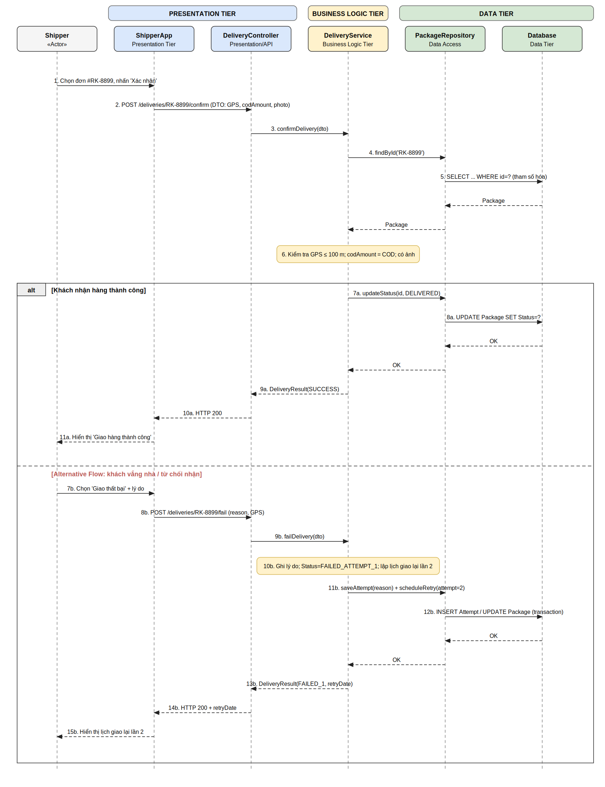

# BT2 – TÁI CẤU TRÚC PHÂN TẦNG VÀ HOÀN THIỆN ĐẶC TẢ CA SỬ DỤNG GIAO HÀNG
**Dự án:** RikkeiLogistics – Phân hệ Giao hàng chặng cuối (App Shipper)

---

## PHẦN 1. NGUY CƠ KỸ THUẬT KHI PRESENTATION TIER GỌI THẲNG SQL DATABASE

Mobile App nhúng câu SQL và kết nối thẳng CSDL nghĩa là chuỗi kết nối và quyền ghi nằm trên thiết bị của người dùng. Kẻ tấn công có thể trích xuất thông tin đăng nhập và tự chạy SQL Injection hoặc `UPDATE` tùy ý trên toàn bộ dữ liệu. Ngoài ra, các quy tắc nghiệp vụ (kiểm tra GPS, đối soát COD, lập lịch giao lại) bị bỏ qua hoàn toàn, và mọi thay đổi schema bắt buộc phải phát hành lại app.

---

## PHẦN 2. SƠ ĐỒ TUẦN TỰ ĐÚNG CHUẨN 3 TẦNG (kèm Alternative Flow)

- File draw.io (mở/chỉnh sửa trên app.diagrams.net): `UC-DELIVERY-01_Sequence.drawio`
- Bản xem nhanh: `UC-DELIVERY-01_Sequence.png` / `.svg`

**Luồng phân tầng:** `ShipperApp` (Presentation) → `DeliveryController` → `DeliveryService` (Business Logic) → `PackageRepository` → `Database` (Data). App chỉ gửi HTTP kèm DTO; `DeliveryService` kiểm tra GPS và đối soát COD; chỉ `PackageRepository` mới thao tác CSDL bằng câu lệnh tham số hóa. Nhánh `alt` thể hiện Alternative Flow "khách vắng nhà / từ chối nhận" (`FAILED_ATTEMPT_1`, ghi lý do, lập lịch giao lại lần 2).

---

## PHẦN 3. ĐẶC TẢ USE CASE UC-DELIVERY-01

**Tên use case:** Cập nhật kết quả giao hàng chặng cuối

| Trường | Nội dung |
|---|---|
| **Actor** | **Chính:** Shipper (dùng ShipperApp). **Phụ:** Hệ thống DeliveryService (Backend), Database. |
| **Pre-condition** | 1. Shipper đã đăng nhập ShipperApp, token còn hiệu lực. 2. Đơn #RK-8899 đã được tiếp nhận hợp lệ, đã phân công cho Shipper này và có trạng thái `OUT_FOR_DELIVERY`. 3. Thiết bị có GPS bật và kết nối mạng tới Backend. 4. Nếu đơn có COD > 0: Shipper đã thu tiền và chụp được ảnh xác nhận. |
| **Main Flow** | 1. Shipper chọn đơn #RK-8899 trong danh sách giao hàng. 2. Shipper nhấn "Xác nhận đã giao hàng". 3. Nếu COD > 0, ShipperApp yêu cầu nhập số tiền thu và chụp ảnh xác nhận; Shipper thực hiện. 4. ShipperApp đóng gói `ConfirmDeliveryDTO` (mã đơn, GPS, số tiền COD, ảnh) và gửi `POST /deliveries/RK-8899/confirm` đến DeliveryController. 5. DeliveryController chuyển DTO cho DeliveryService. 6. DeliveryService lấy đơn qua PackageRepository và kiểm tra: đơn thuộc về Shipper, GPS trong bán kính 100 m quanh địa chỉ giao, số tiền thu bằng COD của đơn, có ảnh xác nhận. 7. DeliveryService yêu cầu PackageRepository cập nhật trạng thái `DELIVERED` (câu lệnh tham số hóa, trong một transaction). 8. Backend trả HTTP 200; ShipperApp hiển thị "Giao hàng thành công". |
| **Post-condition** | **Thành công:** đơn #RK-8899 có trạng thái `DELIVERED`, ghi thời điểm giao, tọa độ GPS, số tiền COD đã thu và ảnh xác nhận; đơn không còn trong danh sách cần giao của Shipper. **Khi giao thất bại:** trạng thái, lý do và lịch giao lại lần 2 được lưu theo nhánh Alternative Flow trên sơ đồ (Phần 2). |

*(Alternative Flow đã thể hiện trên sơ đồ tuần tự ở Phần 2 nên không viết lại bằng văn bản theo yêu cầu đề bài.)*
